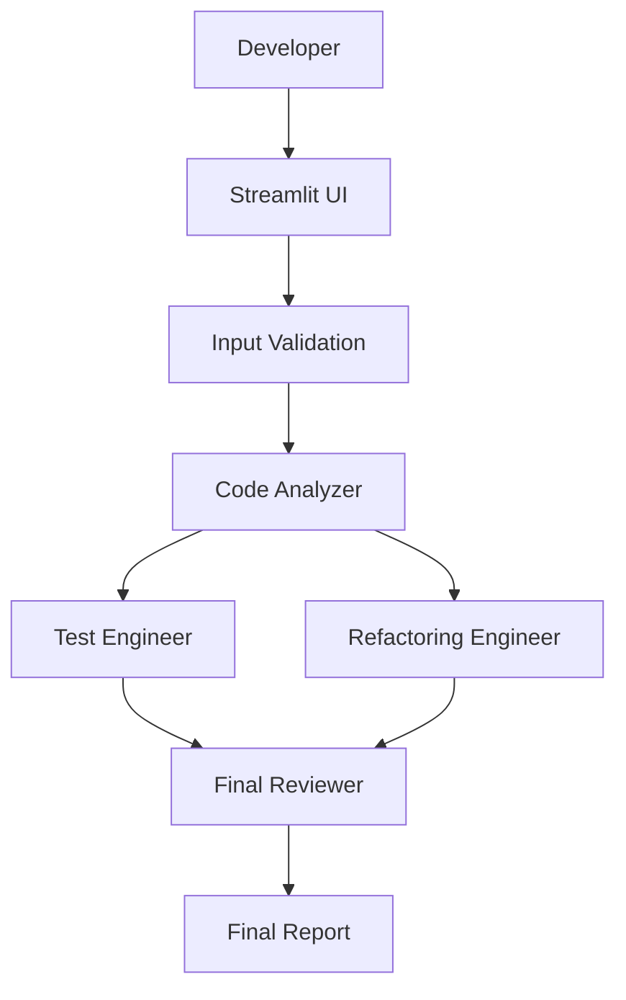

# AI Pair Engineer

## Problem

Developers often receive code reviews only after committing work or opening a pull request. Late-stage feedback creates rework, delays, and context switching. There is a need for immediate, structured feedback during the coding process, before human review.

AI Pair Engineer addresses this by providing a multi-stage AI workflow that analyzes code, generates tests, suggests refactoring, and provides a final quality review — all before a human reviewer looks at the code.

## Solution

AI Pair Engineer is a multi-agent pipeline that processes code through four specialized stages:

1. **Code Analyzer** — Performs static + AI analysis for quality, maintainability, readability, complexity, error handling, performance, and security issues.
2. **Test Engineer** — Generates targeted test cases covering normal behavior, edge cases, invalid inputs, failure paths, and boundary conditions.
3. **Refactoring Engineer** — Improves code maintainability and readability while preserving intended behavior, with explicit change rationale and risk assessment.
4. **Final Reviewer** — Compares original and refactored implementations, checking for behavior preservation, correctness, regressions, and overall quality.

Each stage passes only task-relevant context to the next, reducing token consumption, latency, and irrelevant information propagation.

The system uses Pydantic models for strict structured output validation, ensuring results are predictable and actionable. Low temperature and retry logic provide deterministic, reliable outputs.

## Architecture



### Agent Responsibilities

| Agent | Responsibility |
|-------|----------------|
| **Code Analyzer** | Identifies code smells, maintainability issues, readability problems, architectural concerns, complexity, error handling weaknesses, performance bottlenecks, security vulnerabilities, and code duplication. |
| **Test Engineer** | Generates useful tests covering normal behavior, edge cases, invalid inputs, failure paths, and boundary conditions. Tests are grounded in the code and analyzer findings. |
| **Refactoring Engineer** | Improves maintainability and readability while preserving behavior. Explains each change and associated risks. Avoids unnecessary abstractions. |
| **Final Reviewer** | Strict comparison of original vs. refactored code. Checks behavior preservation, correctness, maintainability, complexity, testability, security, performance, and regressions. Does not approve stylistic changes alone. |

## Context Management

The system deliberately passes only task-relevant context between agents to reduce token consumption, latency, and irrelevant information propagation.

- **Analyzer** receives: language + source code + static analysis evidence
- **Tester** receives: language + source code + analyzer findings (filtered to testing-relevant categories)
- **Refactor** receives: language + source code + analyzer findings (filtered to maintainability/readability categories)
- **Reviewer** receives: original code + refactored code + generated tests + key analyzer findings

This scoped context budgeting ensures each agent focuses on its specific responsibility without noise from upstream/downstream concerns.

## Prompt Reliability

The system does not blindly trust LLM output. Reliability mechanisms include:

- **Explicit output schemas** via Pydantic models — every finding, test case, and change must conform to a validated structure
- **JSON parsing** that handles three formats: raw JSON, JSON inside ```json fences, and JSON with minor surrounding text
- **Retry/correction behavior** — if parsing fails, the system retries with an explicit correction prompt
- **Low temperature** (0.0-0.1) for deterministic code analysis
- **Clear separation** of system instructions and user code in prompts
- **Structured validation** — malformed responses raise errors instead of silently fabricating results

If the LLM returns unexpected format, the system attempts correction before reporting failure.

## Security

The user can submit arbitrary code. **DO NOT execute submitted code directly on the host system.**

The prototype generates tests but does not automatically execute user code. If test execution is implemented in the future, it MUST be isolated in a sandbox/container with strict CPU, memory, filesystem, network, and execution-time limits.

Submitted source code is treated as untrusted input. User code is never interpolated into shell commands.

## Technology Stack

- Python 3.11+
- Streamlit for the frontend
- OpenAI-compatible API client (OpenRouter)
- Pydantic for structured output validation
- python-dotenv for environment configuration
- Minimal dependencies — no orchestration frameworks (LangChain, LangGraph, CrewAI, AutoGen)

## Running Locally

```bash
# 1. Create and activate a virtual environment
python -m venv .venv

Windows:
.venv\Scripts\activate

Linux/macOS:
source .venv/bin/activate

# 2. Install dependencies
pip install -r requirements.txt

# 3. Configure environment variables
copy .env.example .env
# Then edit .env:
# OPENROUTER_API_KEY=your_key_here
# MODEL=deepseek/deepseek-chat

# 4. Run the application
streamlit run app.py
```

## Testing

```bash
pytest
```

All tests mock LLM calls and do not require an OPENROUTER_API_KEY. Tests cover:

- Pydantic schema validation
- JSON response parsing (raw, fenced, malformed)
- Empty input handling
- Python syntax parsing
- Agent behavior with mocked LLM responses

## Example

The file `examples/sample.py` contains intentionally imperfect but safe Python code that gives the AI meaningful issues to identify:

- Nested conditionals
- Mixed responsibilities
- Weak validation
- Possible KeyError
- Testability concerns
- Naming/structure issues

Run the analyzer on this example:

```python
def process_users(users):
    results = []

    for user in users:
        if user["age"] >= 18:
            if user["email"] != "":
                name = user["name"].strip().lower()
                email = user["email"].strip().lower()

                if "@" in email:
                    results.append({
                        "name": name,
                        "email": email,
                        "adult": True
                    })

    return results
```

## Limitations

- Requires an OpenRouter API key for LLM functionality
- Test generation is grounded in code structure; highly dynamic or metaprogrammed code may receive fewer relevant tests
- Refactoring preserves behavior but may not cover all edge cases
- Security analysis is based on code patterns, not runtime analysis
- Single-file analysis; repository-level context not supported
- No automatic test execution (to avoid running untrusted code)

## Future Improvements

- Repository-level analysis across multiple files
- GitHub integration for PR comments
- AST-aware refactoring with concrete syntax tree transformations
- Isolated test execution in containers with resource limits
- Code embeddings/RAG for similar pattern matching
- Persistent review history across sessions
- CI/CD integration for pull request feedback
- Additional language support (Go, Rust, C++, etc.)

## Docker

```bash
docker build -t ai-pair-engineer .
docker run -p 8501:8501 -v "$PWD:/app" ai-pair-engineer
```

The container exposes Streamlit's default port (8501). Ensure OPENROUTER_API_KEY is set in the environment or via a `.env` file mounted into the container.